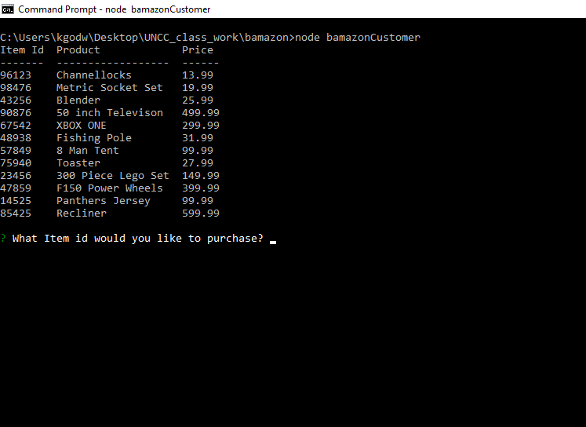

# Bamazon
Command Line Application 
    

    
Displays the table with all of the products for sale

    

    
The customer enters the item number they wish to purchase then ask the quantity  
     that they would like to purchase then would display the item and the total

    

    
Displays that there is insufficient stock for the item the customer wishes to purchase

    

    
Displays the selection for the manager to choose from

    

    
Displays the table with all of the products for sale

    

    
Displays the table with all items with quantity of 5 and below

    

    
Allows the Manager to add more stock to items to are low

    

    
Displays the table with all items and allows the Manager to add more stock to any Item 

    

    
Allows the Manager to add new products to the inventory

    

    
Displays the table with all of the departments and the overhead cost, product sales, and profit

    

    
Allows the Supervisor to add a new Department

## bamazonCustomer app allows the customer to
    * Select an item from a list of items

    * Then allows the customer to select how many of that item they want to purchase

    * Gives the customer the item they ordered and the total of their purchase and if 
      there is insuffiecient quantity to fulfill the oreder it alerts the customer

    * Then allows the customer to either make another purchase or exit the application

## bamazonManager app allows a Manager to 

    * The Manager had the ability to view the products for sale

    * They can also view inventory that is below 5 instock and then ask 
      if they would like to add inventory to any of the items that are 
      low on inventory

    * Also they have the option to add inventory to any of the products for sale

    * They may also be able to add new products to the list of products for sale

## bamazonSupervisor app allows a Supervisor to

    * The Supervisor can view product sales by department which will display a table 
      with the department id the department name the overhead cost for each department 
      the total product sales of that department and the total profit of the department

    * The Supervisor will also have the ability to create new departments

  