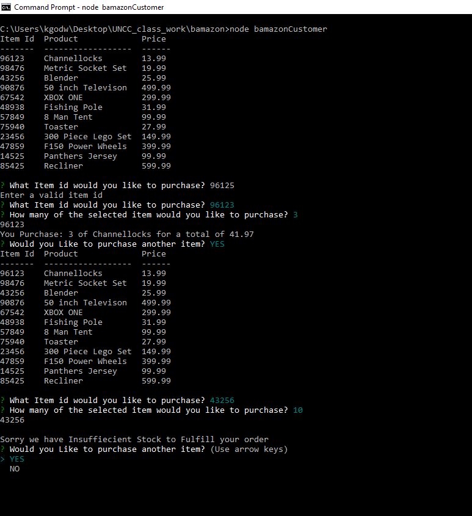
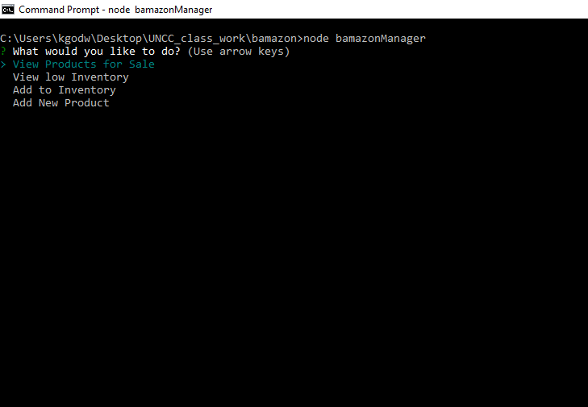
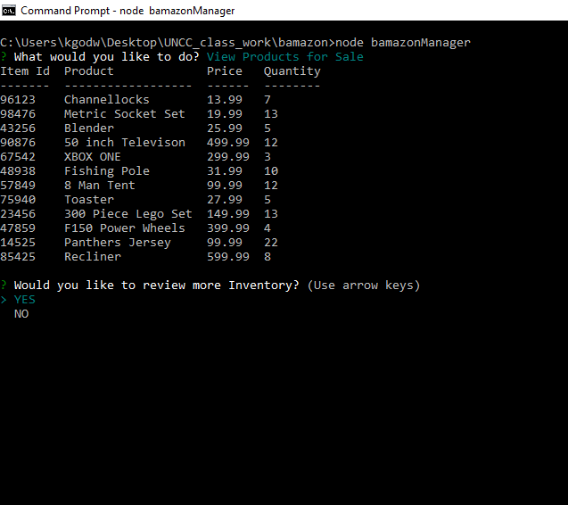
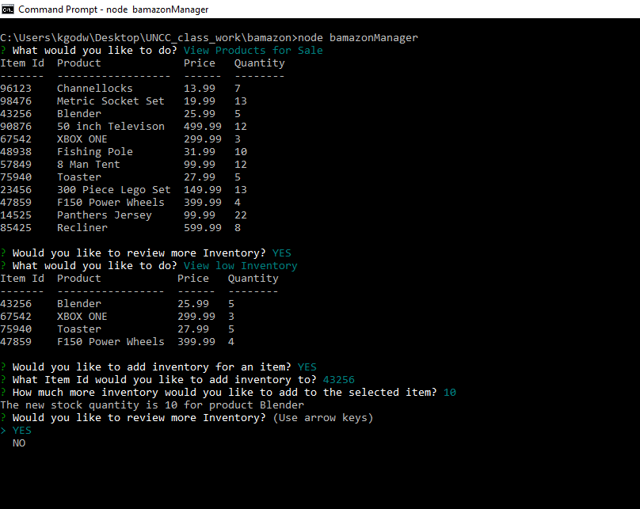
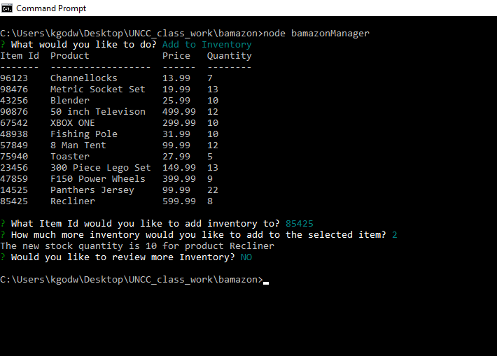
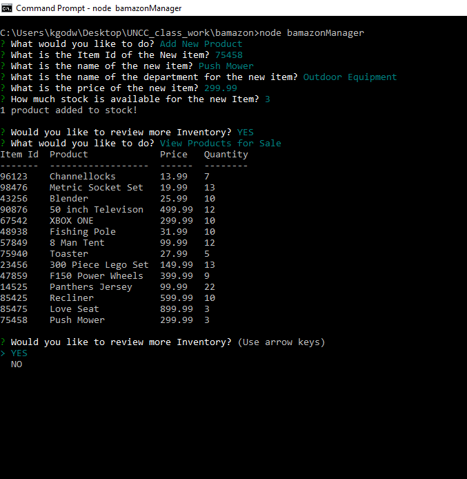
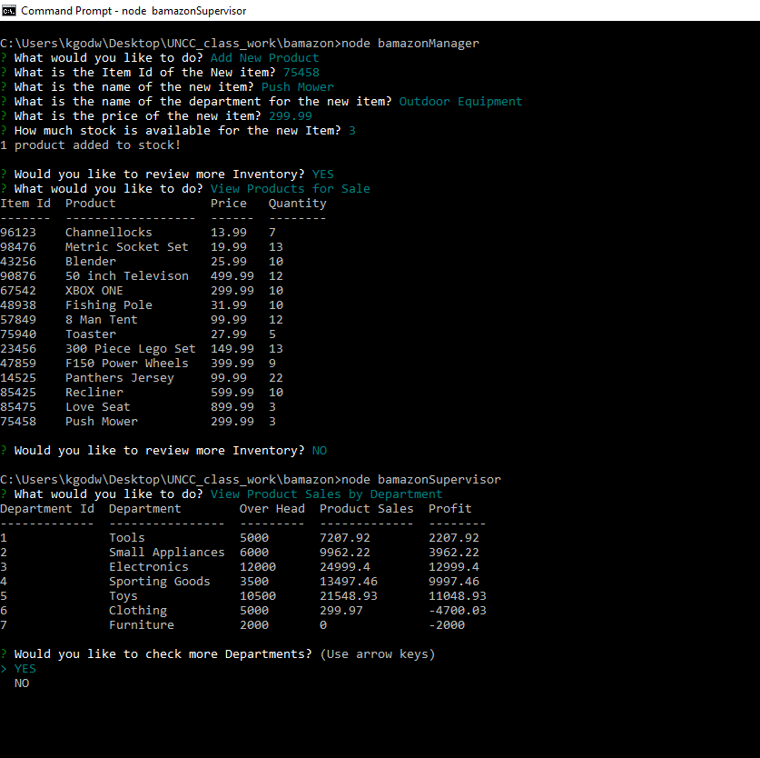
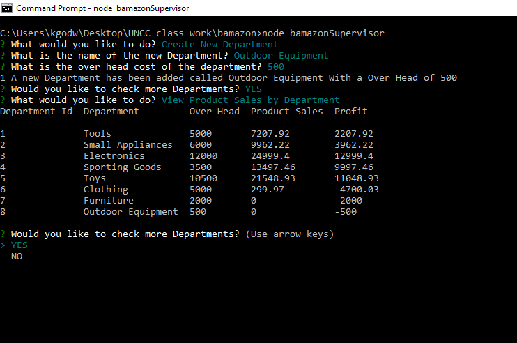

# Bamazon
Command Line Application
## bamazonCustomer app allowws the customer to
    * Select an item from a list of items

    * Then allows the customer to select how many of that item they want to purchase

    * Gives the customer the item they ordered and the total of their purchase and if 
      there is insuffiecient quantity to fulfill the oreder it alerts the customer

    * Then allows the customer to either make another purchase or exit the application

## bamazonManager app allows a Manager to 

    * The Manager had the ability to view the products for sale

    * They can also view inventory that is below 5 instock and then ask 
      if they would like to add inventory to any of the items that are 
      low on inventory

    * Also they have the option to add inventory to any of the products for sale

    * They may also be able to add new products to the list of products for sale

## bamazonSupervisor app allows a Supervisor to

    * The Supervisor can view product sales by department which will display a table 
      with the department id the department name the overhead cost for each department 
      the total product sales of that department and the total profit of the department

    * The Supervisor will also have the ability to create new departments

    
    

    

    

    

    

    

    

    

    

    

